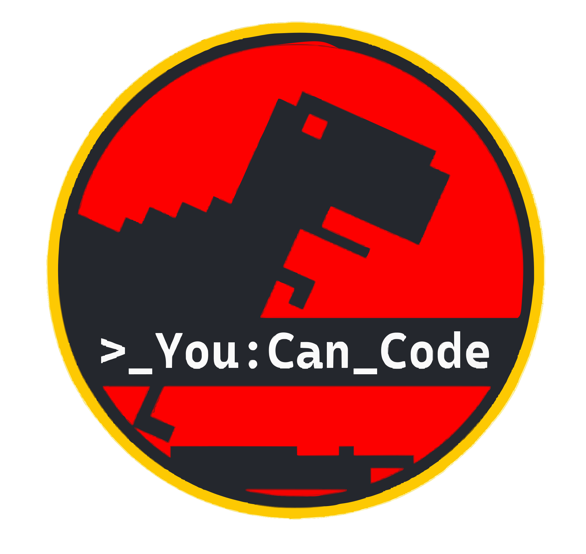

<div align="center">



# You Can Code

[](https://youcancode.net)
[](https://discord.gg/KwfnCyp9T)
[](https://www.stickermule.com/youcancode?sortType=NEWEST)

> **"Don't go extinct."** — *The 'You Can Code' team, probably*

</div>

---

## 🚀 Who are you?

**You Can Code** is a free, beginner-friendly coding education site. We teach coding fundamentals through real-world, story-driven missions — no prior experience required. Whether you're 10 or 40, if you can read this, you can code.

The site is powered by [Docusaurus](https://docusaurus.io/) and lives at **[youcancode.net](https://youcancode.net)**.

---

## 📚 Tutorials

### 🐍 Free Python Course — *Artemis Flight Manual*

Strap in, Mission Control. You're about to launch a rocket using nothing but Python.

This course walks you through **12 hands-on labs + a Final Challenge**, each teaching a core programming concept through a space mission narrative. No experience needed — just follow the labs and you'll be launching rockets in no time. 🦕🚀

| # | Lab | Concept |
|---|-----|---------|
| 🛸 | Pre-Flight Checks | Output (`print`) |
| 1 | Ship Registry | Variables |
| 2 | Fuel Gauges | Integers & Floats |
| 3 | Cargo Manifest | Lists |
| 4 | Safety Checks | Conditionals (`if/else`) |
| 5 | The Countdown | For Loops |
| 6 | Mission Telemetry | Dictionaries |
| 7 | Auto-Pilot | Functions |
| 8 | Data Slicing | List Slicing |
| 9 | Orbital Persistence | While Loops |
| 10 | Logic Overrides | Logical Operators |
| 11 | Fault Isolation | Exception Handling |
| 12 | Automated Filtering | List Comprehension |
| 🌟 | **Final Challenge: The Flight Director** | *Everything above, combined* |

👉 **[Start the Course →](https://youcancode.net/docs/python)**

---

### 📖 Docusaurus Tutorials

Learn how to build and customize your own documentation site with Docusaurus — the same tool powering this site!

- [Docusaurus - Intro](https://youcancode.net/docs/docusaurus)
- [Docusaurus - Basics](https://youcancode.net/docs/category/docusaurus---basics)
- [Docusaurus - Extras](https://youcancode.net/docs/category/docusaurus---extras)

---

## 🛠️ Contributing

Want to help make coding more accessible? Contributions are welcome! Edit any page directly from the site using the **"Edit this page"** link at the bottom of each doc, which opens the file right here in GitHub.

### Local Development

```bash
# Install dependencies
yarn

# Start the local dev server (live reload included 🔥)
yarn start

# Build for production
yarn build
```

### Deployment

```bash
# Deploy via SSH
USE_SSH=true yarn deploy

# Deploy without SSH
GIT_USER=<your-github-username> yarn deploy
```

Pushes to the `gh-pages` branch automatically. Easy.

---

## 🌐 Tech Stack

| Tool | Purpose |
|------|---------|
| [Docusaurus v3](https://docusaurus.io/) | Static site framework |
| [React](https://react.dev/) | Component customization |
| [MDX](https://mdxjs.com/) | Markdown + JSX for docs |
| [Prism](https://prismjs.com/) | Syntax highlighting (GitHub + Dracula themes) |
| GitHub Pages | Hosting & deployment |

---

## 🦕 Community

| Platform | Link |
|----------|------|
| 💬 Discord | [discord.gg/KwfnCyp9T](https://discord.gg/KwfnCyp9T) |
| 🐙 GitHub | [github.com/youcancodenet/main](https://github.com/youcancodenet/main) |
| 🛒 Sticker Store | [stickermule.com/youcancode](https://www.stickermule.com/youcancode?sortType=NEWEST) |

---

<div align="center">

Copyright © 2026 **You Can Code** — Built with 🦕 and [Docusaurus](https://docusaurus.io/)

*__Fact__: T. rex could see in 3D, and in Color, and could definitely see you if you don’t move.*

</div>
